# Linux

## Linux介绍

linux是一个开源、免费的操作系统

## 网络连接的三种模式
1. 桥接模式，虚拟系统可以和外部系统通讯，但是容易造成IP冲突
2. NAT模式，网络地址转换模式，虚拟系统可以和外部系统通讯，不造成IP冲突
3. 主机模式：独立的系统

## 虚拟机克隆（用于集群）
* 方式1，直接拷贝一份安装好的虚拟机文件
* 方式2，使用vmware的克隆操作，注意，克隆时，需要先关闭linux系统

## 虚拟机快照
在使用虚拟机系统的时候，想回到原先的某个状态，也就是说担心可能有些误操作造成系统异常，需要回到原先某个正常运行的状态，就用快照管理。
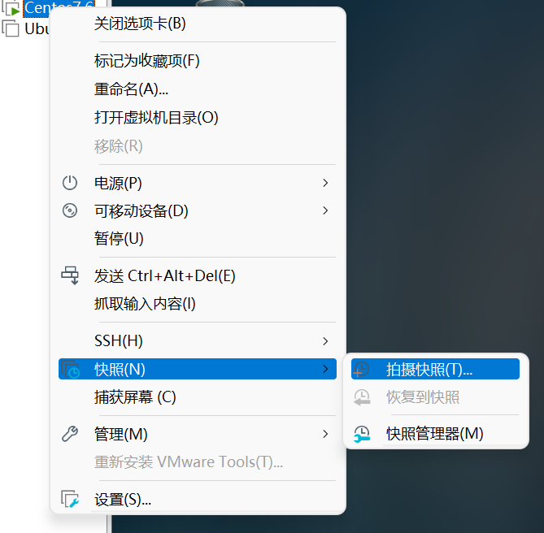
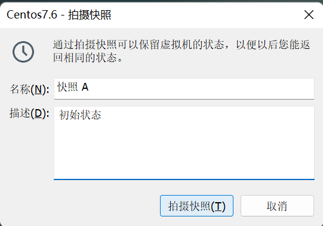
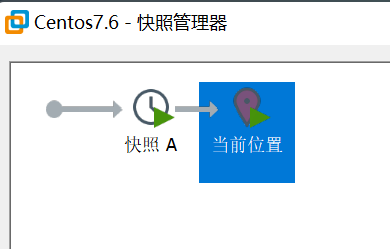
要想恢复：
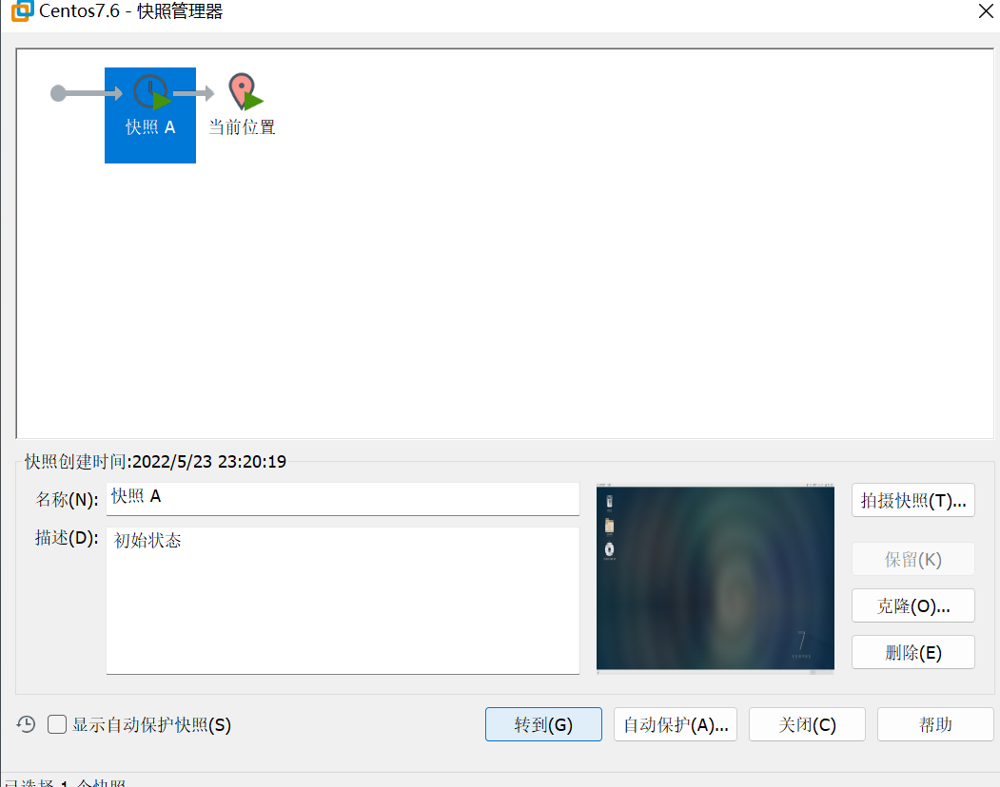

## 虚拟机的迁移和删除
直接拷贝或剪切虚拟系统的文件夹，删除就直接删除那个文件夹

## 安装vmtools
可以设置windows和centos的共享文件夹
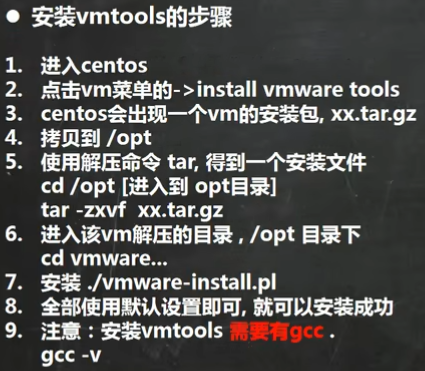
注意：
1. 如果虚拟机->重新安装vmtools变灰，则关机，在开机之后开机完成之前就会变黑
2. 第八点，除了一个不用默认设置，输入no
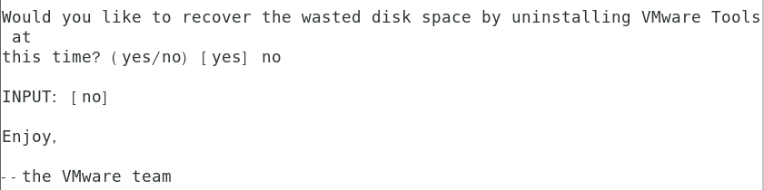
### 设置共享文件夹
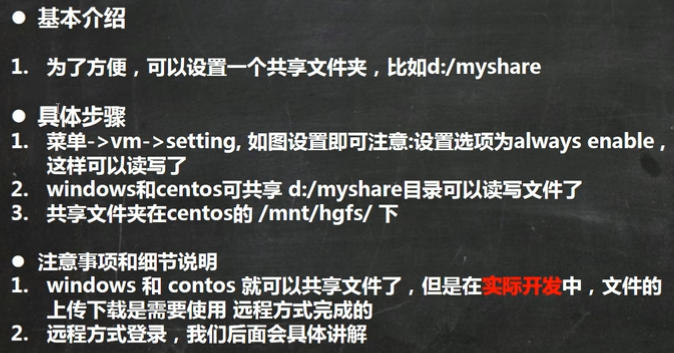

## Linux目录结构
采用层级式的树状目录结构，最上层是根目录“/”，然后在此目录下的其他目录是固定的
在Linux世界，一切皆文件（连硬件也映射成文件）
### 具体的目录结构
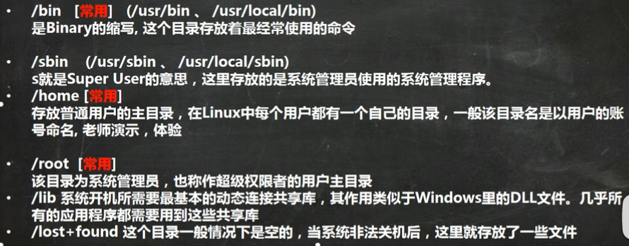
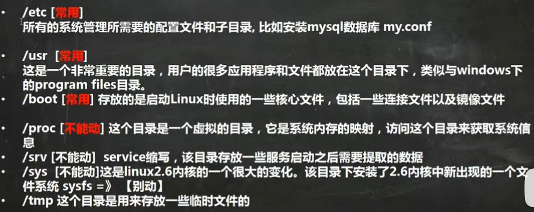
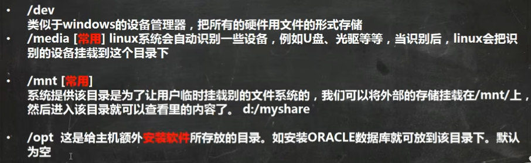
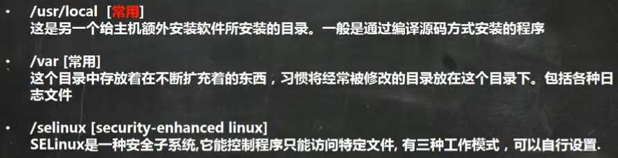

## 远程登录Xshell
下载后文件->新建
主机输入Linux的ip地址（可以用ifconfig获得）
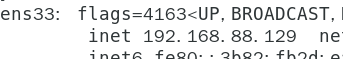
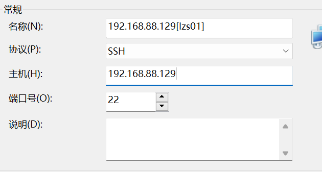
主机一定要是Linux的ip地址，名称可以随便写，之后点击确定就行。
双击新建的会话即可完成连接

## 远程文件传输Xftp
跟上述类似
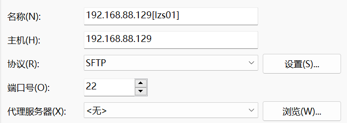
