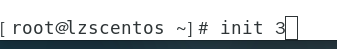
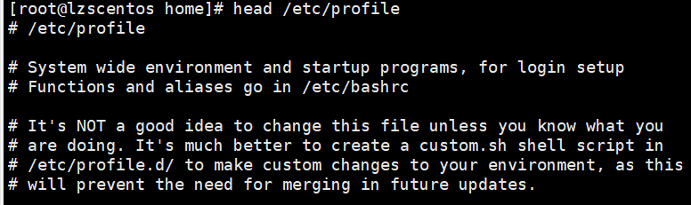
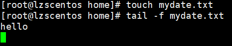
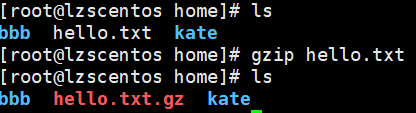
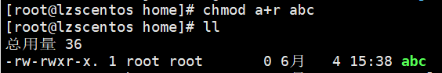
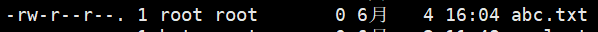

# Linux

## Linux介绍

linux是一个开源、免费的操作系统

## 网络连接的三种模式
1. 桥接模式，虚拟系统可以和外部系统通讯，但是容易造成IP冲突
2. NAT模式，网络地址转换模式，虚拟系统可以和外部系统通讯，不造成IP冲突
3. 主机模式：独立的系统

## 虚拟机克隆（用于集群）
* 方式1，直接拷贝一份安装好的虚拟机文件
* 方式2，使用vmware的克隆操作，注意，克隆时，需要先关闭linux系统

## 虚拟机快照
在使用虚拟机系统的时候，想回到原先的某个状态，也就是说担心可能有些误操作造成系统异常，需要回到原先某个正常运行的状态，就用快照管理。

要想恢复：

## 虚拟机的迁移和删除
直接拷贝或剪切虚拟系统的文件夹，删除就直接删除那个文件夹

## 安装vmtools
可以设置windows和centos的共享文件夹

注意：
1. 如果虚拟机->重新安装vmtools变灰，则关机，在开机之后开机完成之前就会变黑
2. 第八点，除了一个不用默认设置，输入no

### 设置共享文件夹

## Linux目录结构
采用层级式的树状目录结构，最上层是根目录“/”，然后在此目录下的其他目录是固定的
在Linux世界，一切皆文件（连硬件也映射成文件）
### 具体的目录结构

## 远程登录Xshell
下载后文件->新建
主机输入Linux的ip地址（可以用ifconfig获得）

主机一定要是Linux的ip地址，名称可以随便写，之后点击确定就行。
双击新建的会话即可完成连接

## 远程文件传输Xftp
跟上述类似

## vim
### 常用的三种模式

### 快捷键

## 关机重启命令

## 用户登录和注销
登录时尽量少用root登录，可以用普通用户登录，再用“su - 用户名”切换到root
输入logout即可注销用户

## 用户管理
### 添加用户
useradd 用户名：当创建用户成功后，会自动创建和用户同名的家目录

useradd -d 指定目录 新的用户名：给新创建的用户指定家目录

### 指定/修改密码
passwd 用户名

显示当前用户所在的目录：pwd

### 删除用户
userdel 用户名：删除用户，但保留家目录

userdel -r 用户名：删除用户和家目录

一般情况下，建议保留家目录

### 查询用户信息
id 用户名
当用户不存在时，返回无此用户

### 切换用户
su - 切换用户名
权限高切换到权限低不需要输密码，反之需要
当需要返回到原来用户时，输入exit/logout

### 查看当前用户/登录用户
who am i

### 用户组
类似于角色，对有共性/权限的多个用户进行统一管理

### 新增组
groupadd 组名

### 删除组
groupdel 组名

### 增加用户时直接加上组
useradd -g 组名 用户名

### 修改用户的组
usermod -g 组名 用户名

### 用户和组相关文件

zwj没有设置密码，设置密码后：

## 指定运行级别

init [0123456]

## 找回root密码

## 帮助指令
man 获得帮助信息
man [命令或配置文件]（功能描述：获得帮助信息）

在linux下，隐藏文件以.开头
选项可以组合使用，如：

help指令（功能描述：获得shell内置命令的帮助信息）

## 文件目录指令
pwd：显示当前工作目录的绝对路径

ls [选项] [目录或文件]

cd ~ 或 cd ：回到家目录
cd ..：回到上级目录

mkdir用于创建目录
mkdir [选项] 要创建的目录

-p：创建多级目录

rmdir [选项] 要删除的空目录：删除空目录

rm -rf 要删除的目录：删除非空目录

touch 文件名称：创建一个空文件

cp：拷贝文件到指定目录
cp [选项] source dest

-r：递归复制整个文件夹

强制覆盖不提示：\cp

rm：移除文件或目录
rm [选项] 要删除的文件或目录

-r：递归删除整个文件夹
-f：强制删除不提示

mv：移动文件与目录或重命名
mv oldNameFile newNameFile（重命名）

mv /temp/movefile /targetFolder（移动文件）

移动整个目录

可以移动目录或文件的同时重命名

cat：查看文件内容，不能修改
cat [选项] 要查看的文件
-n：显示行号

为了浏览方便，会带上管道命令 | more

more 要查看的文件

less 要查看的文件

echo输出内容到控制台
echo [选项] 输出内容

head用于显示文件的开头部分，默认显示前十行
head 文件（显示前十行）

head -n 5 文件（显示前5行，5可以是任意行数）

tail用于显示文件的尾部，默认显示后十行
tail 文件（显示后10行）

tail -n 5 文件（显示后5行，5可以是任意行数）

tail -f 文件（实时追踪该文档的所有更新）

退出是Ctrl+C

\>重定向（覆盖）和>>追加
ls -l > 文件 （覆盖写）

文件没有会自动创建

ls -al >> 文件 （追加）

cat 文件1 > 文件2 （将文件1内容覆盖到文件2）

echo "内容" >> 文件 （追加）

ln：软链接也叫符号链接，类似于快捷方式

ln -s [原文件或目录] [软链接名]（给原文件创建一个软链接）

删除软链接
请注意：命令更改为rm /home/myroot（如果用下面的命令会连指向的目录下的所有文件都被删掉）

history：查看已执行过的历史指令

history 10：显示最近执行过的10条指令

执行编号为138的历史指令

date：显示当前日期

date +%Y：显示当前年份

date +%m：显示当前月份

date +%d：显示当前是哪一天

显示当前年月日

显示当前年月日时分秒

date -s 字符串时间：设置系统当前时间

cal：显示本月日历

cal 2022：显示2022年日历

ls -lh（h：以人类看得懂的单位显示）

locate指令快速定位文件路径，由于建立了自己的数据库，所以查询速度很快
locate 搜索文件
注意：第一次运行前，必须使用updatedb指令创建locate数据库

which：可以查看某个指令在哪个目录下

grep过滤查找，管道符，"|"，表示将前一个命令的处理结果输出传递给后面的命令处理
grep [选项] 查找内容 源文件
-n：显示匹配行及行号
-i：忽略字母大小写

gzip 文件：压缩文件，只能将文件压缩为*.gz文件

gunzip 文件.gz：解压缩文件

zip [选项] XXX.zip 将要压缩的内容（压缩文件和目录）
-r：递归压缩，即压缩目录

unzip [选项] XXX.zip（解压缩文件）
-d 目录：指定解压后文件的存放目录

tar

压缩文件

解压缩文件

解压到指定目录

## 组管理和权限管理
在linux中每个用户必须属于一个组，每个文件有所有者、所在组和其他组的概念。

### 所有者
一般为文件的创建者
查看文件的所有者

前面的那一列为所有者

修改文件所有者
chown 用户名 文件名

-R：如果是目录，则使其下所有子文件或目录递归生效

chown newowner:newgroup 文件/目录（改变所有者和所在组）

### 所在组
查看文件所在组

后面的一列为所在组

修改文件所在的组
chgrp 组名 文件名

-R：如果是目录，则使其下所有子文件或目录递归生效

改变用户所在组
usermod -g 新组名 用户名

usermod -d 新目录 用户名：改变用户的家目录。**特别说明**：用户有进入到新目录的权限

### 权限的基本介绍

### rwx权限详解

### 修改权限
chmod：修改文件或目录的权限
u：所有者 g：所在组 o：其他组 a：所有人
chmod u=rwx,g=rx,o=x 文件/目录名

chmod o+w 文件/目录名

chmod a-x 文件/目录名

通过数字变更权限
r=4 w=2 x=1 rwx=4+2+1=7
chmod u=rwx,g=rx,o=x 文件/目录名
相当于chmod 751 文件/目录名

